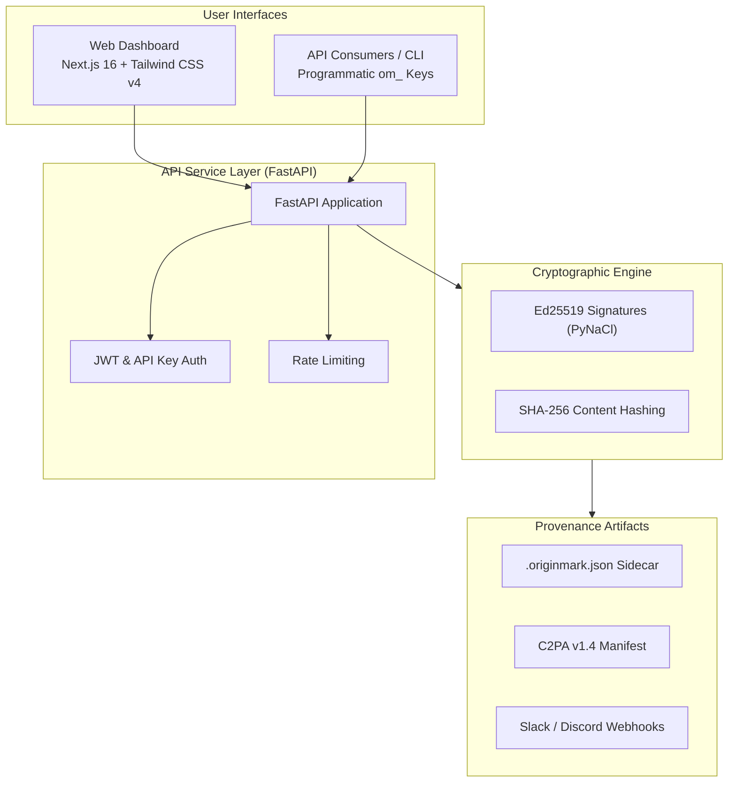
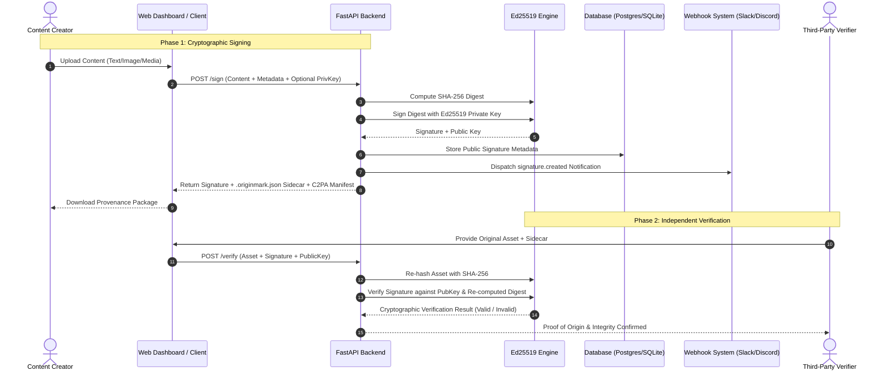

# OriginMark

Cryptographic signing and verification for AI-generated content using Ed25519 signatures and C2PA provenance manifests.

[](LICENSE)
[](https://github.com/krikera/originmark-platform/actions)
[](https://www.bestpractices.dev/projects/14771)
[](CODE_OF_CONDUCT.md)

---

## What it does

OriginMark lets you prove that content (text, images, media) originated from a specific source and has not been altered or tampered with. Think of it like a digital wax seal for AI outputs.

* **The Problem**: Anyone can claim AI wrote something, or conversely that they authored something an AI model actually produced. There is rarely an open, mathematically provable way to verify authenticity.
* **The Solution**: Sign content cryptographically using Ed25519 public-key cryptography. Distribute the cryptographic signature alongside the media in lightweight portable sidecars or industry-standard C2PA v1.4 manifests. Verify integrity anywhere, anytime, without vendor lock-in.

---

## Quick Start

### 1. Backend API (FastAPI)

```bash
# Clone the repository
git clone https://github.com/krikera/originmark-platform.git
cd originmark-platform

# Install dependencies and start the API
cd api
pip install -r requirements.txt
uvicorn main:app --reload
```
The API interactive documentation will be hosted at `http://localhost:8000/docs`.

### 2. Web Dashboard (Next.js 16)

```bash
# From the repository root
cd web
npm install
npm run dev
```
Open `http://localhost:3000` in your browser.

---

## Architecture & How It Works

### Flow & System Overview



### End-to-End Signing & Verification Flow



### Signing and Verification Lifecycle

1. **Hashing**: The binary content of the target file is hashed using SHA-256.
2. **Signing**: The resulting hash is signed using an Ed25519 private key (ephemeral or client-supplied).
3. **Sidecar Generation**: The signature, public key, timestamp, and optional AI model metadata are emitted as a `.originmark.json` sidecar.
4. **C2PA Manifest**: Optionally exportable as a standardized C2PA v1.4 claim generator manifest.
5. **Independent Verification**: Anyone holding the original asset and the sidecar can re-hash the file and mathematically verify the signature against the public key without needing private keys or centralized authority.

### Sidecar Format (`.originmark.json`)

```json
{
  "id": "abc123",
  "content_hash": "sha256...",
  "signature": "base64...",
  "public_key": "base64...",
  "timestamp": "2026-09-23T10:30:00Z",
  "metadata": {
    "author": "John Doe",
    "model_used": "GPT-4"
  }
}
```

---

## API Endpoints

| Method | Endpoint | Description |
|---|---|---|
| `POST` | `/auth/register` | Register new user account |
| `POST` | `/auth/login` | Authenticate and obtain JWT access token |
| `POST` | `/auth/api-keys` | Generate programmatic `om_` API key |
| `POST` | `/sign` | Sign content (Ed25519 or C2PA manifest format) |
| `POST` | `/verify` | Verify content and validate signature integrity |
| `GET` | `/badge?id=X` | Retrieve SVG / HTML verification badge |
| `GET` | `/signatures/{id}` | Retrieve public signature metadata |
| `GET` | `/signatures/{id}/c2pa` | Export signature as C2PA v1.4 JSON manifest |
| `GET` | `/me/signatures` | List authenticated user's signatures |
| `POST` | `/webhooks` | Register Slack or Discord notification webhook |
| `GET` | `/webhooks` | List user's registered webhooks |
| `DELETE` | `/webhooks/{id}` | Remove a registered webhook |

---

## Documentation

* **[Developer Guide](docs/DEVELOPER_GUIDE.md)**: Deep dive into API design, authentication modes, database migrations (Alembic), and schema specifications.
* **[C2PA Integration Guide](docs/c2pa-integration.md)**: C2PA claim architecture, assertions, and manifest schemas.
* **[Flow Diagrams & Visual Architecture](flow_diagrams/README.md)**:
  * **[API Architecture](flow_diagrams/01-api-architecture.md)**: Routing, database models, and authentication logic.
  * **[Web Dashboard Flow](flow_diagrams/02-web-dashboard.md)**: Next.js 16 components, state management, and interaction flows.
  * **[System Overview](flow_diagrams/03-system-overview.md)**: High-level architectural boundaries and external integrations.
* **[Support Resources](SUPPORT.md)**: Community channels, issue filing guidance, and help resources.

---

## Testing

```bash
# Run backend pytest test suite
cd api && pytest

# Run frontend typecheck and linter checks
cd ../web && npm test
```

---

## Feedback, Issues & Discussions

We welcome feedback, questions, and feature suggestions:
* **Bug Reports**: If you encounter an unexpected issue, please [open a Bug Report](https://github.com/krikera/originmark-platform/issues/new?template=bug_report.yml).
* **Feature Requests**: Have an idea for improvement? Propose it in a [Feature Request](https://github.com/krikera/originmark-platform/issues/new?template=feature_request.yml).
* **Discussions**: For general questions, community support, or architectural ideas, visit [GitHub Discussions](https://github.com/krikera/originmark-platform/discussions).

---

## Security

OriginMark follows strict cryptographic and data privacy principles:
* **Private Key Custody**: Private keys are never stored on our servers.
* **Encryption & Hashing**: Ed25519, SHA-256, and bcrypt for password storage.
* **Vulnerability Reporting**: Please report vulnerabilities confidentially via [GitHub Private Vulnerability Reporting](https://github.com/krikera/originmark-platform/security/advisories). Review our [Security Policy](SECURITY.md) for SLAs and supported versions.

---

## Contributing

Contributions make open-source projects thrive! Please read our [Contributing Guidelines](CONTRIBUTING.md) to learn how to set up your environment, follow our testing policy, and submit pull requests.

All participants are expected to adhere to our [Code of Conduct](CODE_OF_CONDUCT.md).

---

## License

This project is licensed under the **MIT License**. See the [LICENSE](LICENSE) file for details.