# Web Dashboard Flow

```mermaid
graph TB
    subgraph "Web Dashboard Flow (Next.js 16)"
        
        UserVisit["User Visits Dashboard"] --> LoadApp["Load Next.js 16 App<br/>Turbopack Dev Server"]
        LoadApp --> ModeSelect{Select Mode}
        
        ModeSelect --> SignMode["Sign Content Mode"]
        ModeSelect --> VerifyMode["Verify Content Mode"]
        
        subgraph SignMode["Sign Content Flow"]
            SignSetup["Configure Metadata<br/>Author, AI Model"]
            SignSetup --> BatchToggle{Batch Mode?}
            
            BatchToggle -->|Single File| SingleSign["Single File Upload"]
            BatchToggle -->|Multiple Files| BatchSign["Batch File Upload"]
            
            SingleSign --> DropzoneSingle["react-dropzone<br/>Single File"]
            BatchSign --> DropzoneBatch["react-dropzone<br/>Multiple Files"]
            
            DropzoneSingle --> ProcessSingle["Process Single File"]
            DropzoneBatch --> ProcessBatch["Process Files Sequentially"]
            
            ProcessSingle --> APICallSign["API Call: /sign"]
            ProcessBatch --> APICallBatchSign["Multiple API Calls: /sign"]
            
            APICallSign --> SingleResult["Display Single Result"]
            APICallBatchSign --> BatchResults["Display Batch Results"]
            
            SingleResult --> DownloadSingle["Download Signature JSON"]
            BatchResults --> DownloadAll["Download All Signatures"]
        end
        
        subgraph VerifyMode["Verify Content Flow"]
            VerifyUpload["Select Content File"]
            VerifyUpload --> SidecarCheck{Sidecar Provided?}
            
            SidecarCheck -->|Yes| ProcessVerify["Process Verification"]
            SidecarCheck -->|No| AwaitSidecar["Await .originmark.json"]
            AwaitSidecar --> ProcessVerify
            
            ProcessVerify --> APICallVerify["API Call: /verify"]
            APICallVerify --> VerifyResult["Display Verification Result"]
            
            VerifyResult --> SuccessDisplay["Success: Valid Signature"]
            VerifyResult --> FailureDisplay["Failure: Invalid / Tampered"]
        end
        
        subgraph UIComponents["UI Components & Features"]
            ResponsiveDesign["Responsive Design<br/>Mobile + Desktop"]
            DragDropZone["Drag & Drop Zone"]
            ProgressIndicators["Progress Indicators"]
            LoadingStates["Loading States"]
            ErrorHandling["Error Handling"]
            ToastNotifications["Sonner Toast<br/>Notifications"]
        end
        
        subgraph AnimationLayer["Animation Layer (Framer Motion)"]
            FadeIn["Fade-in Animations"]
            SlideUp["Slide-up Transitions"]
            ScaleIn["Scale-in Effects"]
            LayoutAnimations["Layout Animations"]
            SpringPhysics["Spring Physics<br/>Tab Switcher"]
        end
        
        UIComponents --> AnimationLayer
        
        subgraph BatchFeatures["Batch Processing Features"]
            ParallelUpload["Sequential File Processing"]
            ProgressTracking["Processing Status per File"]
            ResultsList["Processed Results List"]
            BulkDownload["Bulk Download Actions"]
            ClearResults["Clear Results Action"]
        end
        
        ProcessBatch --> BatchFeatures
        
        subgraph VerificationDisplay["Verification Display"]
            MetadataDisplay["Metadata Terminal Display"]
            HashDisplay["SHA-256 Hash Display"]
            SignatureDetails["Ed25519 Signature Snippet"]
            StatusBadge["Valid / Invalid Status Badge"]
        end
        
        VerifyResult --> VerificationDisplay
        
        subgraph APIIntegration["API Integration Layer"]
            AxiosClient["Axios HTTP Client"]
            FormDataPayload["Multipart Form Data"]
            AsyncEndpoints["Async REST Endpoints"]
        end
        
        APICallSign --> APIIntegration
        APICallVerify --> APIIntegration
        APICallBatchSign --> APIIntegration
        
        subgraph StateManagement["State Management"]
            ReactState["React 19 useState Hooks"]
            FileState["File Upload State"]
            ResultsState["Results State Management"]
            UIState["UI State Control"]
        end
        
        LoadApp --> StateManagement
        
        subgraph Styling["Styling & Design System"]
            TailwindCSS["Tailwind CSS v4<br/>CSS-First @theme Engine"]
            CanvasCards["Minimalist Canvas Cards<br/>Hairline Borders"]
            EmeraldAccent["Emerald Primary Accent<br/>Level Shadows"]
            PillTags["Semantic Status Pills<br/>Micro-badges"]
            ResponsiveGrid["Responsive Grid Layout"]
            CustomFonts["Google Fonts<br/>Inter + JetBrains Mono"]
        end
        
        UIComponents --> Styling
        
        subgraph ModernFonts["Typography Stack"]
            Inter["Inter<br/>Body & Display"]
            JetBrains["JetBrains Mono<br/>Code/Hashes/Badges"]
        end
        
        CustomFonts --> ModernFonts
        
        subgraph Icons["Icon System"]
            LucideReact["Lucide React<br/>Modern Icons"]
        end
        
        UIComponents --> Icons
        
        subgraph Features["Workspace Features"]
            FormatFilter["Format Filter: Images & Text"]
            SidecarMatching["Original Artifact + Sidecar Pairing"]
            CrossBrowser["Cross-browser Compatibility"]
        end
        
        DropzoneSingle --> Features
        DropzoneBatch --> Features
        
        subgraph Security["Security Features"]
            ClientValidation["Metadata Field Validation"]
            StatelessVerification["Independent Verification"]
            EphemeralKeys["Ephemeral Key Generation"]
            SecurityHeaders["API Security Headers"]
        end
        
        APIIntegration --> Security
    end
    
    style SignMode fill:#e8f5e8
    style VerifyMode fill:#fff3e0
    style UIComponents fill:#e3f2fd
    style AnimationLayer fill:#f3e5f5
    style BatchFeatures fill:#fce4ec
    style VerificationDisplay fill:#f1f8e9
    style APIIntegration fill:#e8eaf6
    style StateManagement fill:#fff8e1
    style Styling fill:#f3e5f5
    style Security fill:#ffebee
    style Icons fill:#e8eaf6
```

## Description

This diagram demonstrates the modernized Next.js 16 web application including:

### Modern Stack
- **Next.js 16** with Turbopack dev server and React 19 compiler support
- **React 19** with hooks-based state management
- **Framer Motion** for micro-interactions and transitions
- **Sonner** for modern toast notifications
- **Lucide React** for consistent iconography

### Design System
- **Tailwind CSS v4** with CSS-first `@theme` configuration
- **Minimalist Canvas** cards with subtle hairline borders and refined shadows
- **Emerald Green** brand accents (`#3ecf8e`) with high-contrast neutral inks
- **Typography**: Inter (UI / Headings) and JetBrains Mono (Hashes / Code)

### Features
- Dual-mode interface (sign/verify)
- Batch processing with progress tracking
- Animated tab switcher with spring physics
- Responsive design for mobile and desktop

### Security
- Security headers (HSTS, CSP, X-Frame-Options)
- Client-side validation
- No server-side file storage