# OriginMark System Overview

```mermaid
graph TB
    subgraph "OriginMark System Overview"
        
        subgraph UserLayer["User Interfaces"]
            WebDashboard["Web Dashboard<br/>Next.js 16 + Tailwind CSS v4<br/>Framer Motion"]
        end
        
        subgraph APILayer["API Service Layer"]
            FastAPIServer["FastAPI Server<br/>Python + SQLAlchemy"]
            Authentication["Bearer Token Auth<br/>API Key Management"]
            RateLimiting["Rate Limiting<br/>Per-user Quotas"]
        end
        
        subgraph CryptoLayer["Cryptographic Layer"]
            Ed25519Keys["Ed25519 Key Pairs<br/>Public/Private Keys"]
            DigitalSigning["Digital Signatures<br/>NaCl Implementation"]
            ContentHashing["SHA-256 Hashing<br/>Content Integrity"]
        end
        
        subgraph StorageLayer["Storage Layer"]
            Database[("PostgreSQL / SQLite Database<br/>Users, Keys, Signatures, Webhooks")]
            SidecarFiles["Sidecar JSON Files<br/>Portable Signatures"]
            FileSystem["File System<br/>Local Operations"]
        end
        
        subgraph IntegrationLayer["Integration Layer"]
            WebhookSystem["Webhook System<br/>Slack, Discord"]
            C2PAExport["C2PA Export<br/>Industry Standard"]
        end
        
        subgraph ExternalServices["External Services"]
            SlackAPI["Slack API<br/>Team Notifications"]
            DiscordAPI["Discord API<br/>Community Alerts"]
        end
        
        %% User Layer Connections
        WebDashboard --> FastAPIServer
        
        %% API Layer Connections
        FastAPIServer --> Authentication
        FastAPIServer --> RateLimiting
        FastAPIServer --> CryptoLayer
        FastAPIServer --> StorageLayer
        FastAPIServer --> WebhookSystem
        
        %% Crypto Layer Connections
        CryptoLayer --> SidecarFiles
        CryptoLayer --> Database
        
        %% Storage Layer Connections
        Database --> Authentication
        SidecarFiles --> FileSystem
        
        %% Integration Layer Connections
        WebhookSystem --> SlackAPI
        WebhookSystem --> DiscordAPI
        
        %% Data Flow Indicators
        UserLayer -.->|File Upload| APILayer
        APILayer -.->|Signature Response| UserLayer
        CryptoLayer -.->|Verification| IntegrationLayer
        IntegrationLayer -.->|Notifications| ExternalServices
        
        %% Security Boundaries
        subgraph SecurityBoundary["Security Perimeter"]
            CryptoLayer
            Authentication
        end
        
        %% Local vs Remote Operations
        subgraph LocalOps["Local Operations"]
            SidecarFiles
            FileSystem
        end
        
        subgraph RemoteOps["Remote Operations"]
            FastAPIServer
            Database
            WebhookSystem
            ExternalServices
        end
        
        subgraph ModernStack["Modern Technology Stack"]
            NextJS16["Next.js 16 + Turbopack"]
            React19["React 19"]
            FramerMotion["Framer Motion"]
            Python311["Python 3.11+"]
            Node20["Node.js 20+ LTS"]
        end
    end
    
    style UserLayer fill:#e8f5e8
    style APILayer fill:#e3f2fd
    style CryptoLayer fill:#ffebee
    style StorageLayer fill:#f1f8e9
    style IntegrationLayer fill:#fce4ec
    style ExternalServices fill:#e8eaf6
    style SecurityBoundary fill:#fff3e0,stroke:#ff9800,stroke-width:3px
    style LocalOps fill:#e8f5e8,stroke:#4caf50,stroke-width:2px
    style RemoteOps fill:#e3f2fd,stroke:#2196f3,stroke-width:2px
    style ModernStack fill:#f5f5f5,stroke:#9e9e9e,stroke-width:2px
```

## Description

This provides a high-level view of all OriginMark components showing:

### Modern Technology Stack
- **Next.js 16** with Turbopack for web dashboard
- **React 19** with modern hooks
- **Tailwind CSS v4** styling system
- **Framer Motion** for micro-interactions
- **Python 3.11+** with modern type hints and FastAPI
- **PostgreSQL / SQLite** with SQLAlchemy and Alembic
- **Node.js 20+ LTS** runtime

### User Interfaces
- Web Dashboard (Next.js 16 + Tailwind CSS v4)

### Security Features
- Ed25519 digital signatures
- Content hashing (SHA-256)
- Rate limiting and authentication